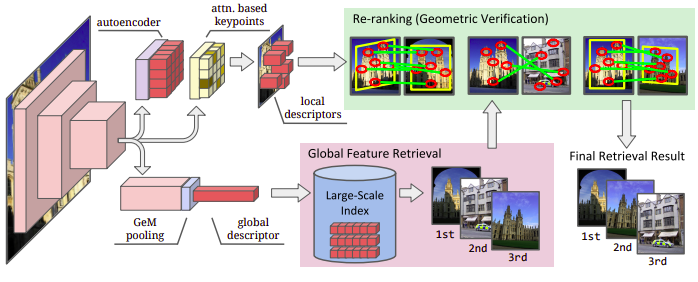
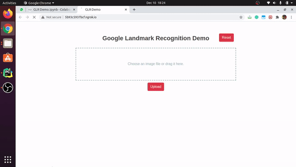

# Google Landmark Recognition Flask DEMO

Flask App made for the [Google Landmark Recognition Challenge](https://www.kaggle.com/c/landmark-recognition-2020) that takes as input, an image of a landmark and predicts its label.

We use the [DELG](https://arxiv.org/abs/2001.05027) (Deep Local and Global features) model for retrieval. 




[](https://github.com/ellerbrock/open-source-badges/) 
[](https://www.python.org/downloads/release/python-380/) 
[](https://opensource.org/licenses/MIT) 

## Demo



## Installation

 1. Install kaggle in your system as given in [Kaggle API Documentation](https://www.kaggle.com/docs/api).
 2. Clone this repository: `$ git clone https://github.com/imlegend19/Google-Landmark-Recognition.git`  
 3. Create a virtual environment: 
     ```
     $ python3 -m venv venv
     $ source venv/bin/activate
     ``` 
 4. Install the requirements: `$ pip install -r requirements.txt`
 5. Setup google-landmark-recognition data.
    ```
    $ chmod +x setup.sh && ./setup.sh
    ```
 6. Bingo! The setup is now complete.

Start the Flask App: `$ python app.py`

> **Note:**
> We use Paris10k Dataset for training instead of the original Google-Landmark-Recognition 2020 dataset due to storage 
> constraints. In case you want to use Google-Landmark-Recognition's dataset, replace the `DATASET_DIR` in 
> `glr/config.py` and download the dataset inside the same.

